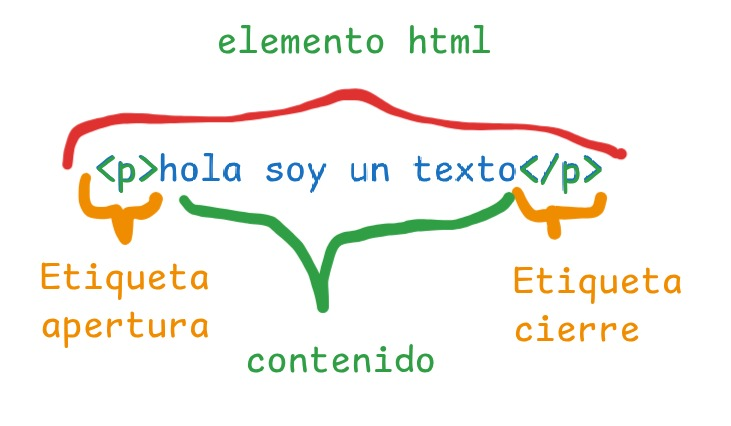

# Que es html
segun sus siglas lenguage de marcado de texto
(Hipertext markup languaje).
html es un lenguaje que nos permite organizar nuestro contenido de manera estructural.
nos permite darle sentido smantico al contenido que nos vayamos creando, eso significa que html le indicara al navegador que tipo de contenido deseamos mostrar.
## que es un elemento HTML
es la manera como html le da un sentido semantico al contenido.
### estructura de un elemento

-existe etiquetas de apertura  
-etiqueta de contenido 
-etiqueta de cierre
 ### etiquetas en bloque
 - h1 - titulo
 - h2 - subtitulo
 - p- parrafos
 - ul - para crear listas desordenadas o con viñetas, esta etiqueta usa en su contenido el elemento
  <li> para crear cada elemento de la lista
 - ol -para crear listas ordenadas o con numeros, al igual que la etiqueta anterior debemos 
   usar en su contenido el elemento <li>para mostrar cada elemento de la lista.
   
 ### etiquetas en linea
 - strong - para poner en negrita
 - i - cursiva
 - sup - para poner un texto en super indice  arriba
 - sub - para poner el texto en sub indice abajo.

### etiquetas con contenido
son los elementos que tiene apertura,contenido y cierre ejm:
- `<h1>titulo</h1>`

### etiquetas vacias
son elementos que solo tienen la etiqueta de apertura ejm: `
`
o etiquetas de multimedia como ``
### Atributos en etiquetas
los atributos nos permiten ampliar la funcionalidad de un elemento los atributos se especifican en las etiquetas de apertura su estructura es la siguiente: `nombre="valor"`
tarea
aqui hacer

